# LuxeStay Hotels Zoho CRM Implementation

A portfolio project demonstrating the end-to-end implementation of Zoho CRM for a fictional luxury hospitality company, including CRM customization, workflow automation, blueprint configuration, dashboards, and reporting.

<p align="center">
  
</p>

This project demonstrates how Zoho CRM can be configured to manage hotel reservations, corporate bookings, wedding enquiries, guest preferences, workflow automation, operational dashboards, and reservation reporting through a fully customized hospitality CRM solution.
---

## Project Overview

LuxeStay Hotels required a CRM capable of managing different reservation types while providing reservation staff with a structured workflow from guest enquiry through booking confirmation.

The solution was designed around the Zoho CRM Leads module, transforming it into a hospitality reservation management system with customized layouts, intelligent field visibility, validation rules, workflow automation, blueprints, dashboards, and operational reports.

---

## Business Requirements

The implementation addresses several hospitality use cases, including:

- Hotel room reservations
- Wedding bookings
- Corporate accommodation requests
- Conference reservations
- Group bookings
- Long-stay reservations
- Internal reservation tracking
- Reservation follow-up management
- Operational reporting

---

## Features Implemented

- Custom Hospitality Leads Module
- Custom Reservation Fields
- Dynamic Layout Rules
- Validation Rules
- Workflow Automation
- Reservation Blueprint
- Hospitality Dashboards
- Operational Reports
- Reservation Management Views

---

## Repository Structure

```text
zoho-crm-hospitality-implementation/
│
├── documentation/
│   ├── Blueprint.md
│   ├── business-requirements.md
│   ├── crm-data-model.md
│   ├── Layout.md
│   ├── Custom-Fields.md
│   ├── Layout-Rules.md
│   ├── validation-rules.md
│   ├── workflow-automation.md
│   ├── Dashboards.md
│   ├── Reports.md
│   ├── leads-module.md
│   ├── project-overview.md
│   └── solution-design.md
│
├── screenshots/
│   ├── blueprints/
│   ├── custom-fields/
│   ├── dashboards/
│   ├── layouts/
│   ├── layout-rules/
│   ├── leads/
│   ├── reports/
│   ├── validation-rules/
│   └── workflows/
│
└── README.md
```

---

## Solution Walkthrough

## Layout Design

<table>
<tr>
<td width="50%">

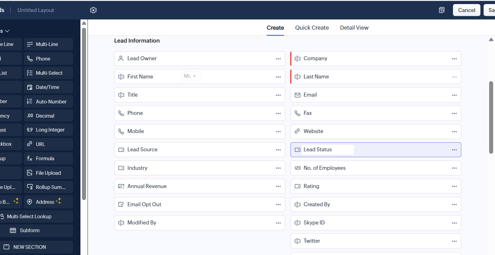

**Default Leads Layout**

The standard Zoho CRM Leads layout before customization, providing the foundation for the hospitality-specific solution.

</td>

<td width="50%">

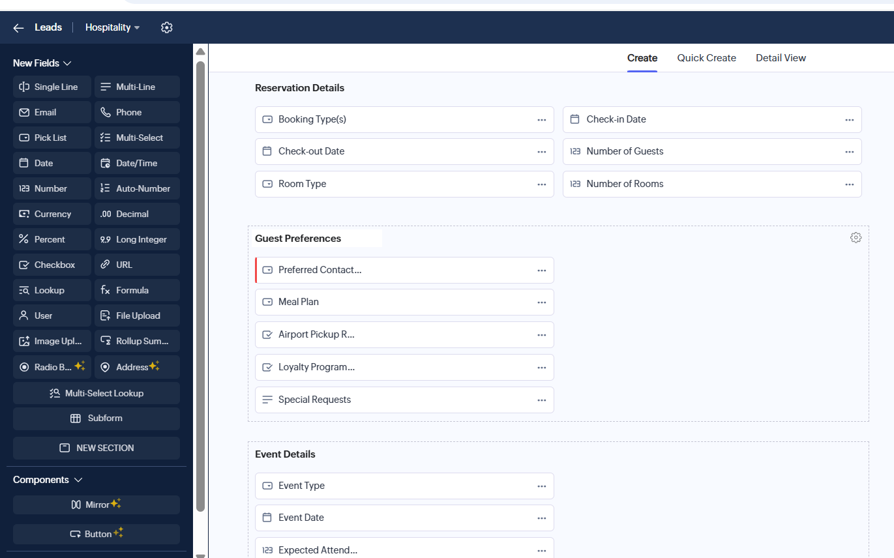

**Customized Hospitality Layout**

A fully customized hospitality layout designed to capture guest enquiries, reservation information, corporate bookings, event details, and internal reservation tracking.

</td>
</tr>
</table>

---

## Custom Fields

<table>
<tr>
<td width="50%">

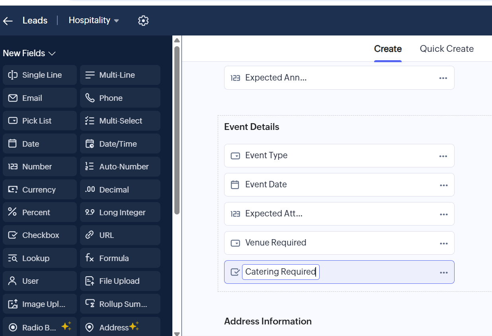

**Event Details Fields**

Custom fields created to capture event-specific information including event type, event date, venue requirements, catering requirements, and expected attendance.

</td>

<td width="50%">

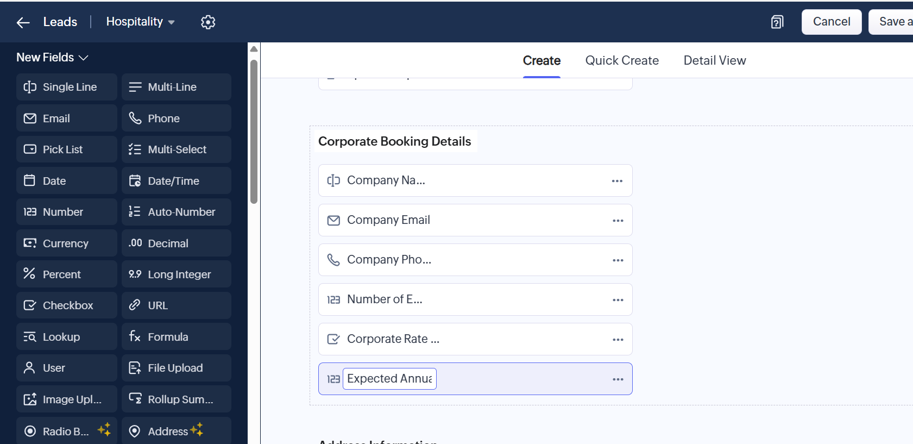

**Corporate Booking Fields**

Dedicated fields for managing corporate reservations including company details, negotiated rates, expected annual bookings, and corporate contacts.

</td>
</tr>

<tr>
<td colspan="2" align="center">

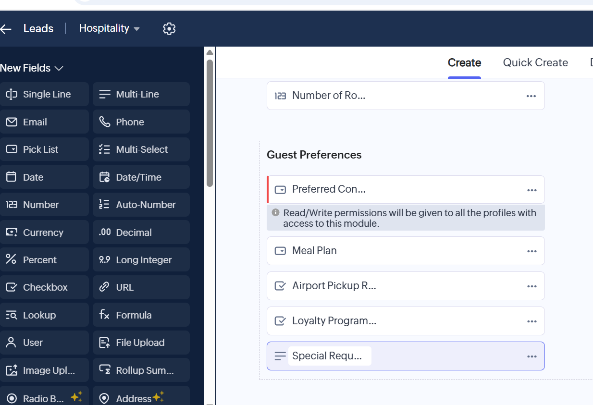

**Guest Preference Fields**

Additional fields capture guest preferences such as meal plans, airport pickup requests, loyalty program participation, preferred contact method, and special requests.

</td>
</tr>
</table>

---

## Dynamic Layout Rules

<table>
<tr>
<td width="50%">

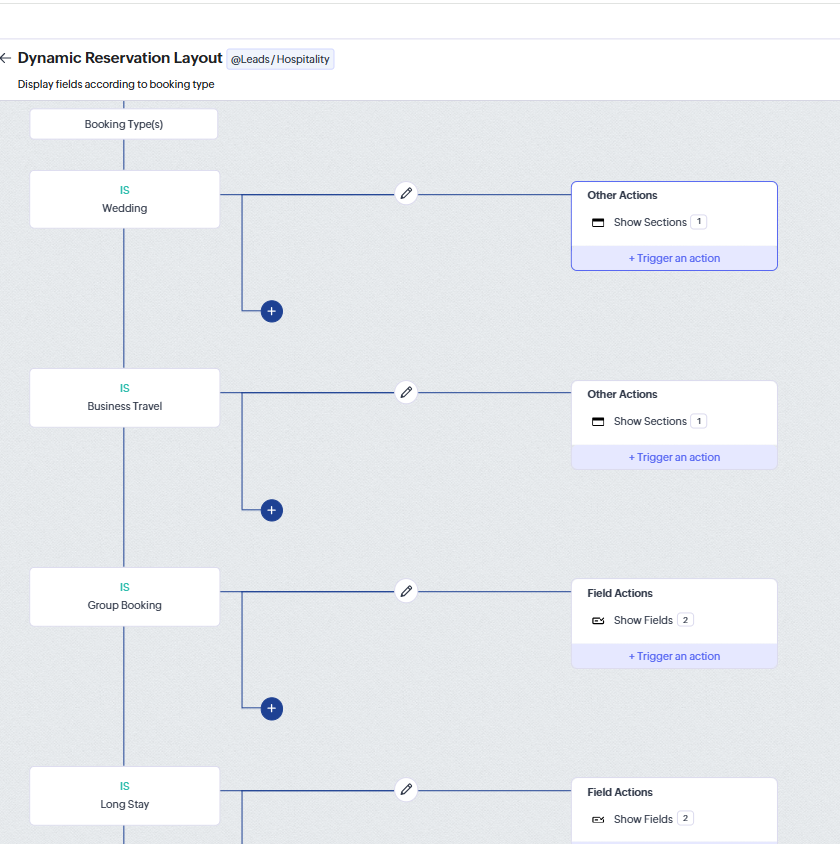

**Layout Rules Overview**

Dynamic layout rules display relevant sections and fields based on the selected reservation type, simplifying data entry and improving user experience.

</td>

<td width="50%">

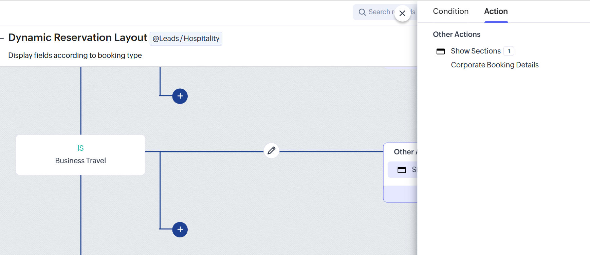

**Business Travel Rule**

Conditional logic automatically displays the Corporate Booking Details section whenever a Business Travel reservation is selected.

</td>
</tr>
</table>

---

## Validation Rules

<table>
<tr>
<td width="50%">


**Validation Rules Overview**

Validation rules ensure reservation information meets business requirements before records can be saved.

</td>

<td width="50%">


**Check-in Date Validation**

Business logic validates reservation dates to ensure accurate booking information and prevent invalid date entries.

</td>
</tr>
</table>

---

## Workflow Automation

<table>
<tr>
<td width="50%">

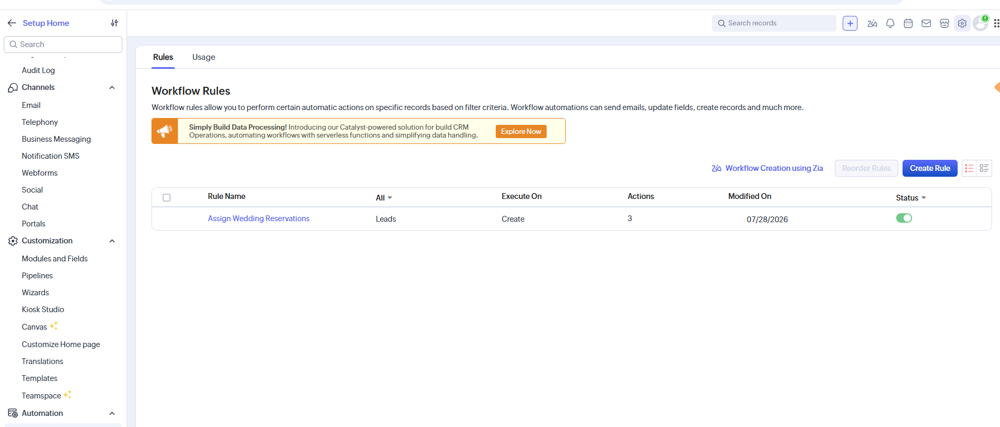

**Workflow Rules Overview**

Workflow automation manages reservation activities, reduces manual effort, and standardizes reservation processing.

</td>

<td width="50%">

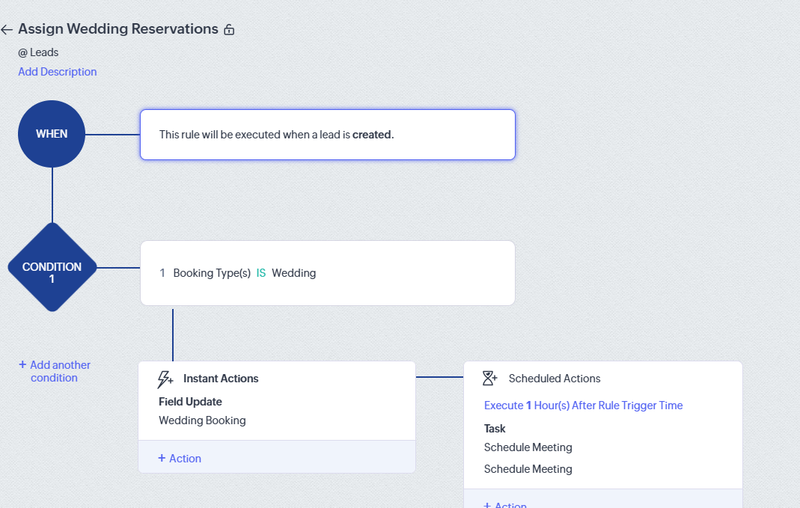

**Wedding Reservation Workflow**

Wedding reservation enquiries automatically update reservation information and schedule follow-up activities for the reservation team.

</td>
</tr>
</table>

---

## Reservation Blueprint

<table>
<tr>
<td width="50%">

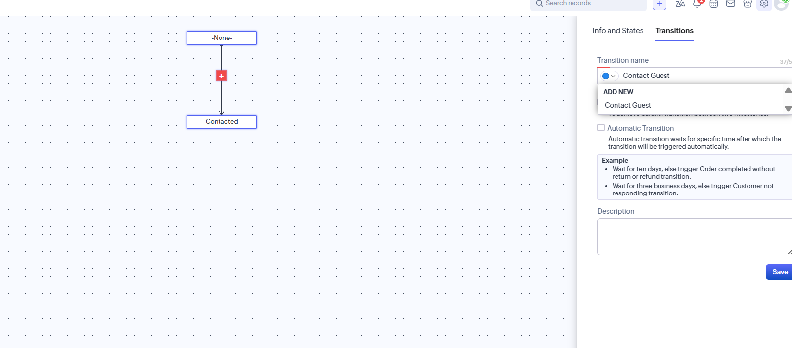

**Contact Guest Transition**

Defines the transition from the initial enquiry stage into active guest engagement within the reservation lifecycle.

</td>

<td width="50%">

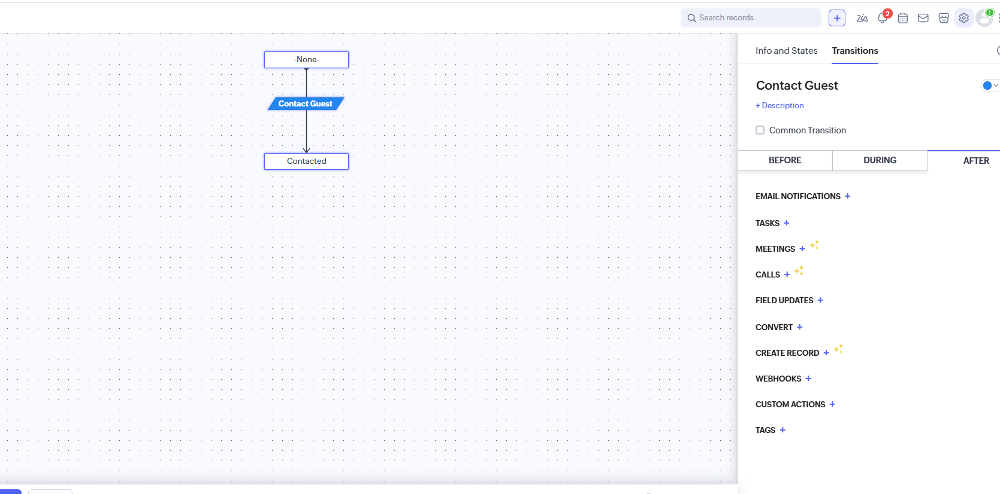

**Transition Actions**

Automated actions available during the Contact Guest transition help standardize reservation processing and improve operational consistency.

</td>
</tr>
</table>

---

## Dashboards

<table>
<tr>
<td width="50%">


**Reservation Dashboard**

Provides management with a real-time overview of reservation activity, booking status, reservation officers, check-ins, and operational KPIs.

</td>

<td width="50%">

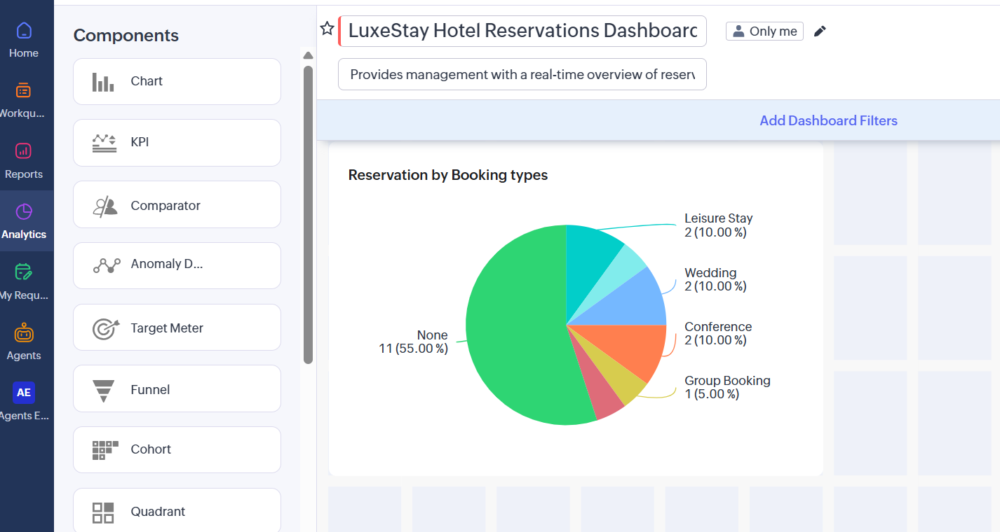

**Dashboard Builder**

Illustrates the dashboard design process used to configure hospitality analytics and management reporting.

</td>
</tr>
</table>

---

## Reports

<table>
<tr>
<td width="50%">

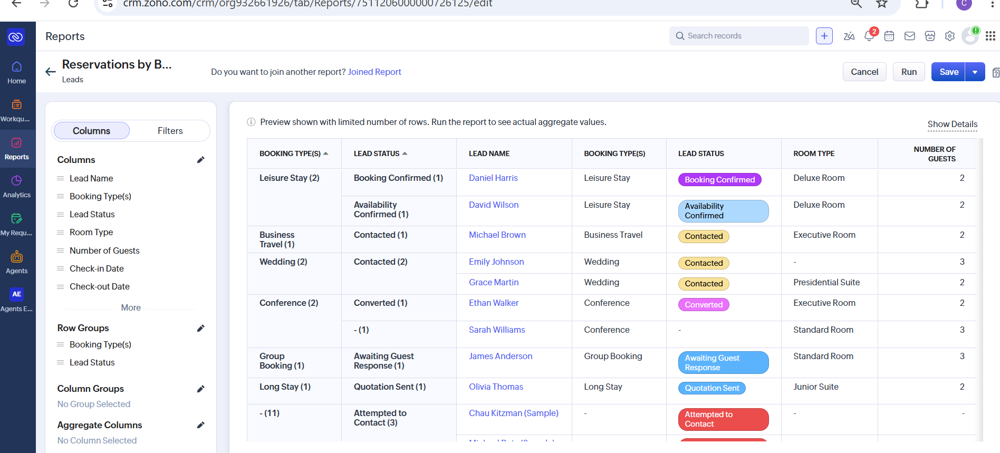

**Reservations by Booking Type**

A reservation report grouped by booking type, lead status, room type, and guest count, providing operational insight into reservation trends and booking distribution.

</td>

<td width="50%">

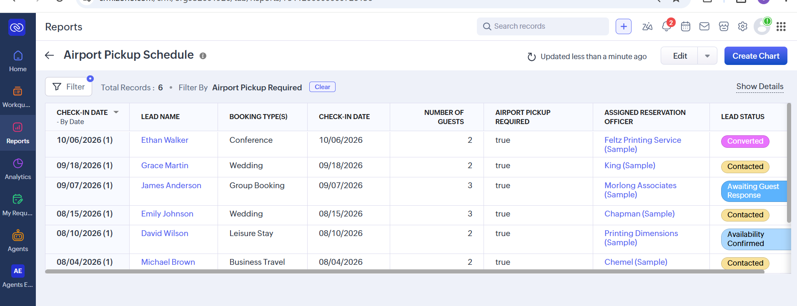

**Airport Pickup Schedule**

A dedicated operational report identifying arriving guests who require airport transportation, including assigned reservation officers and check-in dates.

</td>
</tr>
</table>

---

## Leads Module

<table>
<tr>
<td width="50%">


**Reservation Records**

A centralized reservation workspace displaying guest enquiries, contact information, reservation sources, assigned reservation officers, and booking status.

</td>

<td width="50%">


**Reservation Details**

Custom reservation fields capture booking type, check-in and check-out dates, room preferences, guest count, and other essential reservation information.

</td>
</tr>

<tr>
<td colspan="2" align="center">


**Internal Reservation Tracking**

Internal operational fields support reservation assignment, booking value estimation, follow-up scheduling, reservation priority, and staff coordination throughout the guest journey.

</td>
</tr>
</table>
---

## Skills Demonstrated

- Zoho CRM Administration
- CRM Solution Design
- Business Process Mapping
- Hospitality CRM Configuration
- Workflow Automation
- Blueprint Design
- Validation Rules
- Layout Rules
- Custom Fields
- Dashboard Development
- Report Design
- Business Documentation

---

## Live Repository

🔗 GitHub Repository:

https://github.com/cbmaduka/zoho-crm-hospitality-implementation

This repository contains the complete Zoho CRM hospitality implementation project, including CRM customization, business-specific layouts, custom fields, layout rules, validation rules, workflow automation, Blueprint, reports, dashboards, implementation documentation, and supporting screenshots demonstrating the complete setup from planning through deployment.

## Author

**Chika Blessing**

Executive Business Partner • Success Partner • Healthcare Operations Specialist • CRM & Workflow Automation • Project Manager • Executive Virtual Assistant • Customer Success

---
"Same warmth, wherever you find me."
