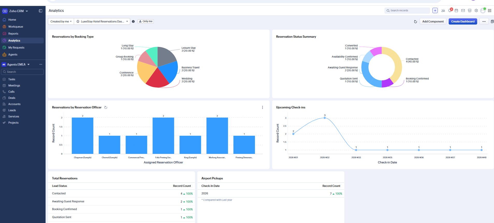
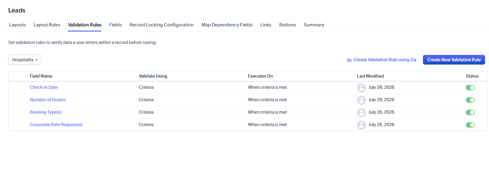
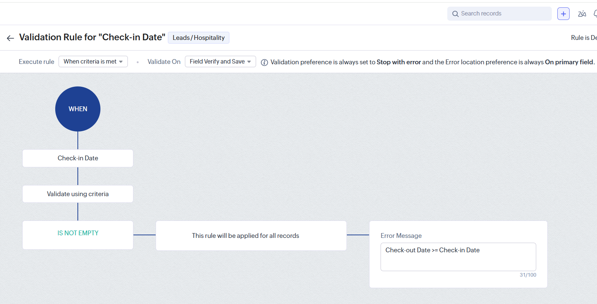
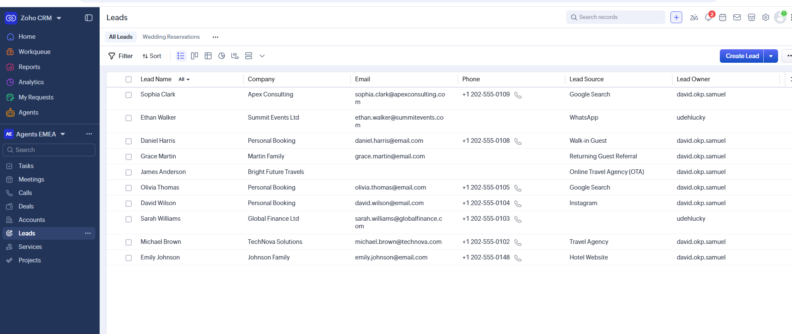
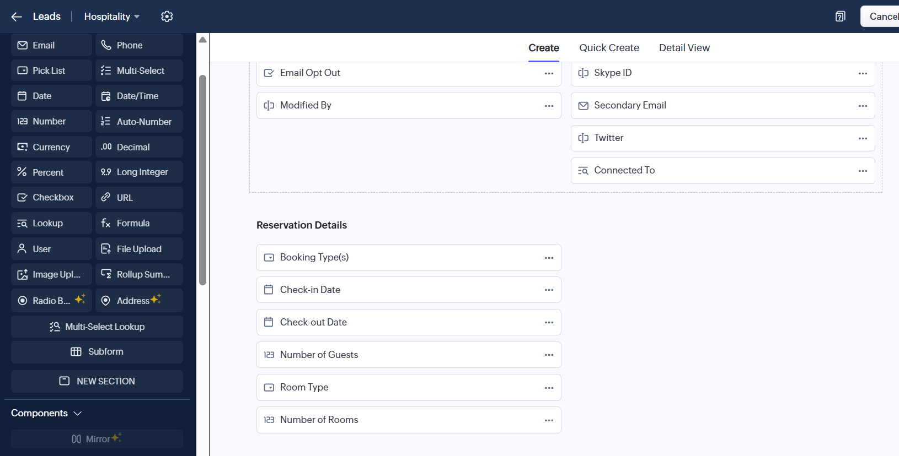
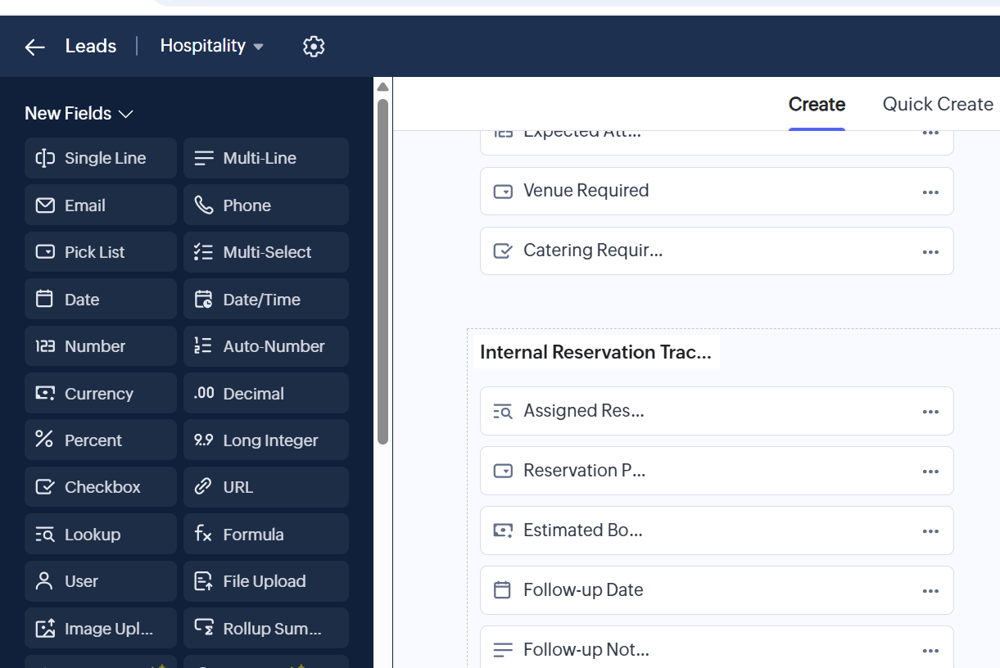

# LuxeStay Hotels Zoho CRM Implementation

A complete Zoho CRM implementation for LuxeStay Hotels, a fictional luxury hospitality company.

<p align="center">
  
</p>

This project demonstrates how Zoho CRM can be configured to manage hotel reservations, corporate bookings, wedding enquiries, guest preferences, workflow automation, operational dashboards, and reservation reporting through a fully customized hospitality CRM solution.
---

## Project Overview

LuxeStay Hotels required a CRM capable of managing different reservation types while providing reservation staff with a structured workflow from guest enquiry through booking confirmation.

The solution was designed around the Zoho CRM Leads module, transforming it into a hospitality reservation management system with customized layouts, intelligent field visibility, validation rules, workflow automation, blueprints, dashboards, and operational reports.

---

## Business Requirements

The implementation addresses several hospitality use cases, including:

- Hotel room reservations
- Wedding bookings
- Corporate accommodation requests
- Conference reservations
- Group bookings
- Long-stay reservations
- Internal reservation tracking
- Reservation follow-up management
- Operational reporting

---

## Features Implemented

- Custom Hospitality Leads Module
- Custom Reservation Fields
- Dynamic Layout Rules
- Validation Rules
- Workflow Automation
- Reservation Blueprint
- Hospitality Dashboards
- Operational Reports
- Reservation Management Views

---

## Repository Structure

```text
zoho-crm-hospitality-implementation/
│
├── documentation/
│   ├── Blueprint.md
│   ├── business-requirements.md
│   ├── crm-data-model.md
│   ├── Layout.md
│   ├── Custom-Fields.md
│   ├── Layout-Rules.md
│   ├── validation-rules.md
│   ├── workflow-automation.md
│   ├── Dashboards.md
│   ├── Reports.md
│   ├── leads-module.md
│   ├── project-overview.md
│   └── solution-design.md
│
├── screenshots/
│   ├── blueprints/
│   ├── custom-fields/
│   ├── dashboards/
│   ├── layouts/
│   ├── layout-rules/
│   ├── leads/
│   ├── reports/
│   ├── validation-rules/
│   └── workflows/
│
└── README.md
```

---

# Project Walkthrough

## Layout Design

<table>
<tr>
<td width="50%">


**Hospitality Lead Layout**

A dedicated hospitality layout designed to capture guest enquiries, reservation information, and operational booking details.

</td>

<td width="50%">


**Reservation Sections**

Logical grouping of reservation information, event details, corporate bookings, and internal reservation tracking.

</td>
</tr>
</table>

---

## Custom Fields

<table>
<tr>
<td width="50%">


**Reservation Fields**

Custom fields for booking type, room details, stay duration, guest information, and reservation preferences.

</td>

<td width="50%">


**Operational Fields**

Internal reservation management fields supporting hotel staff workflows and follow-up activities.

</td>
</tr>
</table>

---

## Dynamic Layout Rules

<table>
<tr>
<td width="50%">


**Conditional Layout Rules**

Different reservation types dynamically display only the information relevant to that booking.

</td>

<td width="50%">


**Context-Aware Forms**

Corporate, wedding, conference, and group reservations each reveal their appropriate sections and fields.

</td>
</tr>
</table>

---

## Validation Rules

<table>
<tr>
<td width="50%">



**Validation Configuration**

Business rules ensure reservation data is entered correctly before records can be saved.

</td>

<td width="50%">



**Date Validation**

Reservation dates are validated to maintain accurate booking information.

</td>
</tr>
</table>

---

## Workflow Automation

<table>
<tr>
<td width="50%">


**Workflow Configuration**

Automation rules manage reservation activities and reduce manual administrative work.

</td>

<td width="50%">


**Wedding Reservation Automation**

Wedding enquiries automatically update reservation status and generate scheduled follow-up tasks.

</td>
</tr>
</table>

---

## Reservation Blueprint

<table>
<tr>
<td width="50%">


**Reservation Lifecycle**

Blueprint standardizes the reservation process from enquiry through guest engagement.

</td>

<td width="50%">


**Controlled Progression**

Reservation stages follow a consistent operational workflow for every guest enquiry.

</td>
</tr>
</table>

---

## Dashboards

<table>
<tr>
<td width="50%">


**Reservation Overview**

Provides management with a high-level view of reservation activity and booking performance.

</td>

<td width="50%">


**Reservation Pipeline**

Tracks enquiries throughout the reservation lifecycle.

</td>
</tr>
</table>

---

## Reports

<table>
<tr>
<td width="50%">


**Reservation Status Report**

Tracks reservation progress grouped by lead status.

</td>

<td width="50%">


**Upcoming Check-ins**

Provides upcoming guest arrivals for operational planning.

</td>
</tr>

<tr>
<td width="50%">


**Airport Pickup Schedule**

Identifies arriving guests requiring transportation services.

</td>

<td width="50%">


**Reservations by Booking Type**

Analyzes reservation activity across booking categories.

</td>
</tr>
</table>

---

## Leads Module

<table>
<tr>
<td width="50%">



**Reservation Records**

Centralized management of hotel reservation enquiries.

</td>

<td width="50%">



**Reservation Details**

Dedicated reservation information designed for hospitality operations.

</td>
</tr>

<tr>
<td colspan="2" align="center">



**Internal Reservation Tracking**

Operational fields supporting reservation ownership, follow-up activities, and internal coordination.

</td>
</tr>
</table>

---

## Skills Demonstrated

- Zoho CRM Administration
- CRM Solution Design
- Business Process Mapping
- Hospitality CRM Configuration
- Workflow Automation
- Blueprint Design
- Validation Rules
- Layout Rules
- Custom Fields
- Dashboard Development
- Report Design
- Business Documentation

---

## Author

**Chika Blessing**

Executive Business Partner • Success Partner • Healthcare Operations Specialist • CRM & Workflow Automation • Project Manager • Executive Virtual Assistant • Customer Success
